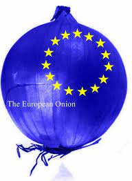

# 20. Policy and Economics, Systems of Government, the European Union

## Osnova: 
* CZ
  * type of government
  * parliament
  * political parties
  * head of state
* UK
  * type of government
  * parliament
  * political parties
  * head of state
* EU
  * when was eu created?
  * main idea of creating EU?
  * original members
  * istitutions of the EU
  * Schengen area

### Významná slovíčka:
* ambassador - velvyslanec 
* capital - hlavní město 
* compulsory - povinný 
* constitution - ústava 
* constitutional monarchy - konstituční monarchie 
* elect - volit 
* exectutive department - ministerstvo 
* goverment - vláda
* House of Commons - dolní sněmovna 
* House of Lords - horní sněmovna
* House of representatives - Sněmovna reprezentantů 
* Prime minister - premiér   

## Příklad řeči:
### Czech Republic

CR is a democratic state with the government divided into 3 powers that run the state. First is a legislative power, represented by Parliament. Second is executive power, represented by the President. The last one is judicial, represented by various levels of courts.

Parliament is divided into two chambers. First is the CHAMBER OF DEPUTIES. 200 deputies every 4 years. Deputy must be older than 21. The second is the SENATE. 81 senators. Elections are every 2 years but every senator is elected for 6 years. Senator must be older than 40. Elections are public, secret, democratic, equal, direct, and universal. Everybody older than 18 who has Czech citizenship can vote.

In elections, every senator or deputy is in a political party. The most famous are ANO, ODS, Piráti. The leader of the winning party becomes the Prime Minister. The government is made of the Prime Minister, Vice-Premier, and ministers, and there are many ministries, like industry, justice, finance, transport, and many more.

Judicial power is divided into various levels. The most important are Constitutional Court and Supreme Court.

Our President (Miloš Zeman now) is elected by people every 5 years and he can be elected only 2 times in a row. He is representing the country. He appoints all ministers. He can refuse a bill or declare an amnesty.

The most important national symbols are: National anthem – Kde domov můj, national flag – 3 colors, red at the bottom, white is at the top and blue is a triangle on the left side.

### Great Britain

The United Kingdom is a constitutional monarchy. The UK consists of England, Scotland, Wales, and Northern Ireland. British political system is headed by a monarch (Queen Elizabeth II). The powers of the monarch are ceremonial. Parliament is divided into two Houses. First is the House of Commons and second is the House of Lords. Any new bill must pass through both Houses and after that, it is sent to the Queen for the Royal Assent. 

The main functions of the UK parliament are to make and change laws, debate the important issues of the day, check and challenge the work of the Government, and more.

Parliament is often called Westminster because it is housed in a building in central London called the Palace of Westminster.

The House of Commons is the lower chamber but the one with the most authority. The House of Commons has 650 Members of Parliament. They sit on the long green-covered benched and there is only seating capacity for 437 people. Elections to choose MPs take place every 5 years.  Every citizen over 18 can vote.

The House of Lords is the upper chamber but the one with less authority. The main roles are to revise legislation and keep a check on Government. There is no fixed number of members in the House of Lords. 

British Government is formed by a political party that has the majority in the Parliament and Queens appoints its leader as the Prime Minister. PM chooses about 20 ministers to form a special advisory group called the Cabinet.

Today there are four major political parties in the British parliamentary system – The Conservative Party, The Labour Party, The Scottish National Party, The Liberal Democrat Party

The current queen is Elizabeth II. She has been Queen of the United Kingdom, Canada, Australia, and New Zealand since 6 February 1952. As head of state, the Queen goes on official State visits abroad. She also invites other world leaders to come to the UK.

Important national symbols are the National flag that symbolizes the Union of England, Scotland, and Ireland. Each country has its cross in the flag. Britain's national anthem is „God Save the Queen.

### USA

The USA is a federation of 50 states, governed by the President. 48 of 50 states are on the continent, Alaska is in the North, and Hawaii in the mid-Pacific.

The constitution went into effect in March 1787. This document guarantees freedom of religion, free speech, the right to a fair trial, and protection against cruel and unusual punishment. It was divided into 3 branches – legislative, executive, and judicial.

The legislative branch is made up of elected representatives. The Congress is divided into two parts: The House of Representatives and the Senate. The House of Representatives consists of about 450 lawmakers who are elected for 2 years. Senate has 100 – 2 for each state of the federation – who serve for 6 years. The main task of Congress is to make federal laws.

The executive branch is represented by the President and 13 executive departments. He is elected every 4 years. The main tasks of the President are: President proposes and vetoes bills, serves as the Commander in Chief of Armed Forces, sings treaties, and appoints federals judges and ambassadors.

The judicial branch is made up of Federal Districts Courts, 11 Federal Courts of Appeals and on the top the Supreme Court.

In the USA there are two main political parties: The democratic party, which is more liberal, and the Republican Party, which puts more emphasis on private enterprise and individual initiative.

The national flag consists of 50 white stars symbolizing the 50 American states, and one larger oblong consisting of 6 white and 7 red stripes symbolizing the original 13 states. The national anthem is called „The Star-Spangled Banner.

### EU

Eu is a confederation of 27 countries in Europe. It started in 1957 as EEC – European Economic Community. It created an economic area in Europe – people are allowed to move and trade in other EU countries almost it was their own. 16 of them also share the same currency: Euro

Why was the EU made? Some nations wanted to unite after the second World War to prevent another war among them. First were France, Germany, Belgium, the Netherlands, Luxemburg, and Italy. EU was established in 1992. CZ became a member in 2004. 

The main institution is: the European Parliament – has 785 members and the seat of the parliament is in Strassbourg and Brussels. Other is The Council of the EU, The European Central Bank, and more.

Flag – 12 golden stars on a blue background, stars in a circle symbolizes the idea of unity, solidarity, and harmony among the people of Europe.

Original Members - Belgium, Denmark, France, Germany, Greece, Ireland, Italy, Luxembourg, the Netherlands, Portugal, the United Kingdom, Spain.

The Schengen Area is the name given to the territory of the 26 European countries (Schengen Agreement countries, abbreviated as Schengen countries) in which persons can cross the borders of the contracting states at any point without going through border controls.

### Specific task: 
What ways is the EU coping with new trends in automation, robotic automation and artificial intelligence? Comment on these!

* Agriculture 4.0
* Triffid arm
* Eu goals

## Příklad řeči:
* Agriculture 4.0 - a farming management concept that takes advantage of new technologies and data collection
to increase yields and boost efficiency, to make farms work smarter not harder
* Project Triffid arm - To Help Deliver Internet Of Things
* The European Commission is currently exploring what measures and legislation are needed to realize the full 
the potential of AI while protecting EU citizens.
* 45%-60% of all workers in Europe could see themselves replaced by automation before 2030.