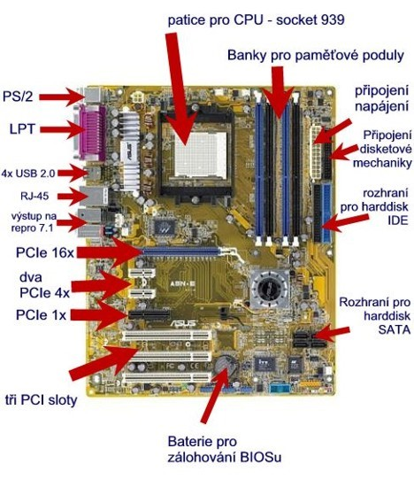

# 1. HW - základní deska a její části

## Základní deska:

- Základní deska (anglicky mainboard či motherboard) 
představuje základní hardware většiny počítačů. Hlavním 
účelem základní desky je propojit jednotlivé součástky počítače 
do fungujícího celku a rozdělit jim elektrické napájení, které základní 
desce poskytne zdroj. Postupem času se funkce základní desky rozšiřovala 
v tom, že sama začínala obsahovat některé komponenty, které se dříve musely 
připojovat externě.
- Typická základní deska umožňuje zapojení procesoru a operační paměti. 
Další komponenty (např. grafické karty, zvukové karty, pevné disky, mechaniky) 
se připojují pomocí rozšiřujících slotů nebo kabelů, které se zastrkávají do 
příslušných konektorů. Na základní desce je dále umístěna energeticky nezávislá 
paměť FlashROM, ve které je uložen systém BIOS, který slouží k oživení počítače hned 
po spuštění.
- Základní deska zajišťuje komunikaci mezi komponenty počítače; tvoří páteř počítače
- Přímo na základní desce se nachází – CMOS paměť, RAM paměti, nebo přídavné karty
Připevněné pomocí kabelů – HDD, CD-ROM
- Základní desky se mohou lišit v jejich rychlosti, počtech konektorů, typu patice 
- Některé komponenty mohou být integrované přímo na základní desce; zvuková a síťová karta
- Sběrnice – svazek vodičů kudy proudí veškeré informace mezi jednotlivými komponenty; záleží na rychlosti sběrnice – rychlejší tok informací 
- Je zde umístěna polovodičová paměť FlashROM, ve které je uložen BIOS
- Většina základních desek obsahuje tyto součásti:
    - Patice pro připojení procesoru – PGA (AMD piny na procesoru); LGA (Intel piny na socketu)
    - Čipovou sadu – chipset = která umožňuje procesoru komunikovat s ostatními částmi počítače
    - FlashROM paměť obsahující BIOS
    - Paměťové konektory pro moduly operační paměti RAM
    - Řadiče a sběrnice PCI, AGP, PCI-Express
        - PCI: PCI nebo PCI Standard je počítačová sběrnice pro připojení periferií k základní desce. 
        - AGP: (zkratka pro Accelerated Graphics Port nebo též Advanced Graphics Port) je v informačních technologiích speciální patice pro připojení grafické karty.
        - PCI-Express: PCI-Express je v informatice standard systémové sběrnice, který byl vytvořen jako náhrada za starší standardy PCI, PCI-X a AGP. Označení sběrnice není zcela správné, protože se jedná o dvoubodové spoje, na kterých jsou data přenášena bez potřeby adresy. 
    - Konektory pro připojení napájecího zdroje
    - Integrované přídavné součásti – síťové, grafické, zvukové …
    - Baterie – potřeba k napájení CMOS čipu, který ukládá základní hodnoty BIOS a konfigurační parametry PC
- BIOS (Basic Input Output System) – slouží pro komunikaci hardwaru PC s OS
    - detekuje základní hardware, připojené paměti…
    - při každém spuštění PC BIOS otestuje a nastaví hardware
    - BIOS zprostředkovává komunikaci mezi HW a SW
    - nastavuje parametry integrovaných zařízení (řadiče disků, zvukový čip, integrovaný grafický čip
    - typy: AMI BIOS, AWARD
    - je možné jej zaheslovat

## Procesor:

- Centrální procesorová jednotka (CPU) = mozek počítače, zpracovává a vyhodnocuje téměř 
všechna data, informace, požadavky, úkoly, které PC realizuje, řídí jeho činnost
- umí vykonávat strojové instrukce (strojový kód) počítačového programu
- Základní stavební jednotkou procesoru je tranzistor zapojený jako spínač, jeho úkolem je měnit stav mezi
 logickou nulou a jedničkou – v procesoru jsou jich až miliardy
 - Socket procesoru slouží k propojení procesoru se základní deskou, rozlišujeme základní dvě architektury:
    - PGA – architektura, kde jsou piny zespod procesoru, které se zasouvají do socketu na základní desce 
    - LGA – architektura, kde jsou piny v socketu namísto v procesoru
- Frekvence procesoru – jak rychle dokáže tranzistor v procesoru změnit stav z logické jedničky na nulu; 
udává se v Hz; často také označováno jako kmitočet nebo takt procesoru; frekvence je jedním z hlavních faktorů, 
které ovlivňují výkon procesoru – aktuálně se pohybují v rozmezí 1,5GHz až 4,5GHz
- Parametry procesoru:
    - Rychlost – počet operací provedených za jednu sekundu; také označováno jako frekvence
    - Počet instrukčních kanálů – kolik instrukcí dovede procesor vykonat v jednom taktu
    - Šířka slova – max. počet bitů, které je možné zpracovat během jedné operace 
    - Interní cache paměť – kapacita rychlé interní cache paměti – vyrovnávací paměť k ukládání mezivýpočtů 
    - Počet jader – čím více jader tím dokáže procesor provádět několik operací naráz
    - Patice/socket – potřeba aby byla kompatibilní se základní deskou
- Výrobci: Intel (LGA), AMD (PGA), Samsung, Qualcomm, Apple

## Čipová sada (Chipset):

- Je hlavní logický integrovaný obvod základní desky
- Jeho úkolem je řídit komunikaci mezi procesorem a ostatními zařízeními
- V dnešní době převažují čipové sady, které se dělí na dva integrované obvody, ale občas se objevují již spojené do jednoho chipu
    - Severní most (North bridge)
    - Jižní most (South bridge)
- North bridge – nazýván obvodem MCH
    - Zajišťuje komunikaci mezi procesorem, operační pamětí, grafickou sběrnicí AGP nebo PCI Express x16 a také zajišťuje spojení s jižním mostem
    - Některé obsahují integrované grafické karty
    - Základní prvek, který určuje rychlost, druh procesorů, jejich množství a druh paměti RAM, který bude použit
    - Hraje roli pokud chceme přetaktovat procesor na vyšší frekvence z důvodu chlazení
- South bridge – nazýván obvodem ICH
    - Je pomalejší než severní most, umožňuje připojení periferních zařízení k základní desce
    - Obsahuje řadiče disků ATA, SATA, RAID; USB; PS/2 a řídí komunikaci na sběrnici PCI, PCI Express pro připojení rozšiřujících karet
    - Dále je připojen zvukový adaptér, paměťový obvod obsahující BIOS, integrovaný síťový adaptér

## Chlazení:
- Teplovodivá pasta
- Pasivní chlazení:
    - kovová nepohyblivá součástka, která má na sobě navařená žebra pro zajištění co největší plochy z důvodu lepšího předávání tepla okolnímu vzduchu (vyrobeny buď z mědi(dražší) nebo z hliníku (levnější))
- Aktivní chlazení – nejčastěji se jedná o chlazení vzduchem nebo vodou:
    - Proudícím vzduchem - rotující ventilátor vhání pomocí vhodně tvarovaných lopatek vzduch na pasivní část chladiče, která je v přímém kontaktu s chlazenou komponentou a odvádí od ní teplo (nejčastěji používáno jako doplněk pasivního chlazení)
    - Vodní chlazení - tvoří uzavřený okruh ve kterém chladící médium, v tomto případě voda, obíhá; na jedné stran se přenáší teplo z chlazené komponenty do kapaliny a na druhé straně tuto kapalinu ochlazujeme; voda dokáže odvést více tepla než vzduch

# Typy konektorů:
1. Napájecí konektor počítače - pro připojení napájecího kabelu, na jehož druhém konci je standardní zásuvka 
2. VGA, DVI,... 
    - VGA: konektor grafické karty - připojení monitoru
    - DVI: taky připojuje monitor, ale narozdíl od VGA, který je veden analogově jsou informace vedeny 
    digitálně
    - HDMI: rychlejší digitální, narozdíl od předešlých kromě videa přenáší i zvuk 
3. PS/2 - starší konektro pro připojení myši a klávesnice 
4. Paralelní port - původně pro připojení tiskáren, skenerů i některé externí mechaniky (dnes se již nepoužívá)
5. Hudební konektory - standardní 3.5mm 'jacky' => vývody zvukové karty. Připojení reproduktorů, mikrofonů a 
jiných hudebních zařízení 
6. USB - je navržen pro připojení všech možných typů externích zařízení a  to dokonce za chodu počítače
7. SCSI - standardní rozhraní a sada příkazů pro výměnu dat mezi externími nebo interními počítačovými 
zařízeními a počítačovou sběrnicí.
8. RJ45 - dnes nejčastěji používaný typ zapojení síťových kabelů UTP a STP 

## RAM a ROM paměti:

- Rozdíl – RAM – pro čtení i zápis; ROM – pouze pro čtení
- Podle schopnosti zápisu
    - RAM – pro čtení a zápis
    - ROM – paměť pouze pro čtení – data jsou uložena jednorázově při výrobním procesu
    - PROM – pomocí speciálního zařízení (programátor) si ji naprogramuje uživatel, poté nelze změnit
    - EPROM – informaci zapsanou v paměti je možné vymazat UV zářením a znovu přeprogramovat (uložení dat, která nejsou potřeba měnit, např. řízení mikrovlnky)
    - EEPROM – mazání probíhá pomocí elektrického impulsu, počet zápisů je omezen cca 100 000 (např. uložení hlasitosti v TV)
    - Flash ROM – elektricky programovatelná paměť; uchovává informace v paměťových buňkách; informace zachovává i po odpojení od elektrického napájení (SD karty)
- RAM:
    - dělíme na:
        - SRAM (statická RAM) – je velmi rychlá a vyžaduje menší proud než paměť dynamická – registry, CACHE
        - DRAM (dynamická RAM)  – SDRAM  (synchronní DRAM); DDR; DDR2 – nižší napájecí napěti; DDR3 – nižší spotřeba a vyšší kmitočet 
            - SIPP – byl používán u některých počítačů; paměťový modul neměl klasické kontakty ale piny, náchylné k poškození
            - SIMM – už má kontakty a výhodou byla snadnější instalace oproti SIPP
            - DIMM – všechny novější paměti (SDRAM, DDR, DDR2, DDR3) jsou umístěny na těchto modulech DIMM; šířka sběrnice je 64 bitů
            - SO-DIMM – nejčastěji určeny pro notebooky
            - využívá se pro data, která procesor rychle potřebuje, po vypnutí PC se vymaže
- Cache – vyrovnávací paměť umístěna mezi dvě zařízení, která nepracují stejnou přenosovou rychlostí; několik druhů L1, L2, L3 od nejrychlejší po nejpomalejší

- Dělení pamětí dle provedení: 
    - RAM: 
        - Pamět s libovolným přístupem/operační paměť 
        - Po zapnutí PC se uloží operační systém do paměti RAM 
        - Použítí: operační a vyrovnávací paměti 
    - ROM: 
        - Slouží pouze pro čtení
        - Používá se pro BIOS
    - HARD DISK: 
        - Hlavní paměťové médium, na kterém jsou uložena všechna data potřebná 
        k činnosti PC. Také se zde ukládají data vytvřená uživatelem počítače.
        - Slouží k trvalému uchování informací v PC.

## Sběrnice:

- jedná se prakticky o jakýkoli kabel či kontakt v počítači
- dělí se na: datová, adresní, řídící
- používají se k přenosu dat, informací a ke komunikaci jednotlivých částí PC, každé zařízení v PC musí být připojeno k nějaké sběrnici
- Parametry sběrnic:
    - Přenosová rychlost – určuje maximální počet bitů přenesených za 1 sekundu
    - Šířka sběrnice – kolik dat je schopno projít za jeden takt – 64bit 128 bit
    - Taktovací kmitočet – přenos informací po sběrnici je řízen hodinovými impulsy, počet těchto hodinových impulsů za 1 sekundu udává základní frekvenci sběrnice
- Sběrnice pro rozšiřující karty – slouží k rozšíření možností počítače pomocí rozšiřujících karet 
    - PCI – systémová sběrnice pro připojení rozšiřujících karet do základní desky; používá paralelní přenos dat; přenos oběma směry; nabízí plug and play
    - AGP – vysokorychlostní sběrnice; je přímo napojena na severní most čipové sady; pomocí této sběrnice lze připojit k počítači výhradně grafická karta

## Rozhraní (interface):

- Rozhraní RS-232 (COM port)
    - Starší typ sériového rozhraní
    - Používalo se pro připojení počítačové myši k počítači, propojení staršího mobilního telefonu s počítačem
    - V současné době se uplatňuje pouze při propojení počítače s různými měřícími systémy
    - Rozhraní už není implementováno na základní desky, nahrazeno USB
    - Nepodporuje technologii Plug and Play
- Rozhraní CENTRONICS (LPT port)
    - Starší paralelní rozhraní pro komunikaci s pomocí 17 linek
    - Původně byl vytvořen pro komunikaci s tiskárnou; jednosměrný přenos z počítače do tiskárny
    - Později byl přidán oboustranný přenos

    - Konektory – DB-25(počítač) a Centronics (tiskárna)
- Rozhraní USB
    - Sériové rozhraní umožňující připojit širokou škálu zařízení k počítači
    - Pomocí USB lze připojit téměř každou periférii
    - Využívá vrstvenou hvězdicovou topologii, kde je v centru každé hvězdice USB hub
    - Obsahuje jeden kořenový HUB, který je považován za nejvyšší úroveň
    - Dva typy konektorů typ A – plochý konektor – obsažen na každém novém PC 
    - Typ B  - je určen pro periferní zařízení, čímž je zároveň definován standard propojovacího kabelu
    - Plug and Play
    - Typ miniaturizovaný konektor – Mini USB; Micro USB (mobily)
- Rozhraní FireWire
    - Vysokorychlostní sériové rozhraní vyvinuté pro přenos audia a videa dat 
    - V dnešní době slouží především pro připojení digitální videokamer, externích HD a optických mechanik
    - Různá specifikace IEEE – liší se hlavně rychlostí 
    - Konektor typ 1 – obvykle se nachází v počítači a rozbočovače
    - Typ 2 – obvykle se nachází v periferním zařízení
- Rozhraní Bluetooth
    - Komunikační rozhraní sloužící k bezdrátovému propojení mezi dvěma a více elektronickými zařízeními
    - Propojení mobilního telefonu, PDA, osobní či přenosný počítač, hands-free sada, polohovací zařízení, klávesnice, chytré hodinky
- PS/2 – fialový klávesnice; zelený myš
- RJ-45 – konektor pro připojení počítače do lokální sítě pomocí kabelu
- Firewire port – připojení především kamery či ext. HDD
- Růžové kolečko – mikrofon
- Zelené kolečko – přední reproduktory nebo sluchátka
- Modré kolečko – audio vstup
- eSATA port – pro připojení externích HDD

[Otázka 2](02HW.md)

[seznam otázek](seznam_otazek.md)