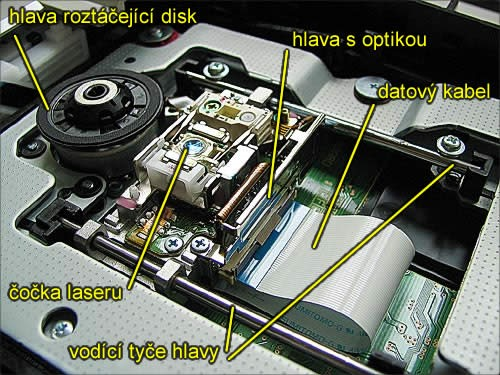

# 2. HW - Vnější paměti s optickým záznamem

## Princip:
- pro záznam a adresaci dat používá světelný laserový paprsek o určité vlnové délce
- ke svému fungování potřebuje čtecí/zapisovací mechaniku
- data nejsou ukládána do kružnic ale do dlouhé spirály (začíná od středu)
- optický disk je navržen tak, aby podporoval jeden ze tří druhů záznamu: pouze pro čtení -  read-only (CD-ROM); pro záznam – recordable (CD-R); přepisovatelné – rewritable (CD-RW)
- nejčastěji se používají k ukládání zvuku (CD), videa (DVD a Blu-ray) a dat v PC
- disk se čte ve čtecí mechanice, kde se roztočí na rychlost cca 4000 otáček za minutu
- vysvětlující video: https://www.youtube.com/watch?v=45O8ifExW0Q&list=WL&index=35

## Typy:
- CD (Compact disc):
    - pro čtení a zápis se používá laserové světlo s vlnovou délkou 785 nm
    - průměr nejčastěji 12 cm ale existuje i varianta 8 cm, tloušťka 1,2 mm
    - 1 vrstva záznamu
    - Audio CD – nejstarší CD formát, pouze pro zvuk
    - CD-ROM – pro záznam dat, pouze pro čtení
    - CD-R („zapisovatelné CD“; vyrábějí se prázdná, lze zapsat jednou na každé místo, tzn. je možné např. nejdříve zapsat jen jednu stopu a dopsat další později, pokud je médium ponecháno „otevřené“) a CD-RW („přepisovatelné CD“; lze zapisovat opakovaně)
    - data se tzv. vypalují do hliníkové fólie, která je krytá polykarbonátem – nevýhodné pro dlouhodobé uložení dat, protože hliník oxiduje
    - kapacita 700 MB
- DVD (neoficiálně Digitam Video Disc):
    - digitální optický nosič, nejčastěji využívaný pro záznam filmů ve vysoké kvalitě
    - při vývoji byl kladen důraz na zpětnou kompatibilitu s CD – jsou si velmi podobné
    - průměr 12 cm a tloušťka 1,2 mm
    - data se ukládají do 1-2 vrstev do tvaru spirály
    - pro čtení se používá laserové světlo s délkou 660 nm – umožňuje to vyšší kapacitu
    - oproti CD poskytuje lepší korekci chyb, vyšší kapacitu záznamu a odlišný souborový systém, který není zpětně kompatibilní s CD-ROM
    - maximální možné rozlišení je 720x576
    - rychlost DVD mechaniky se udává jako násobek 1350 kB/s – mechanika s rychlostí 16x umožňuje přenosovou rychlost 16 x 1350 = 21600 kB/s (cca 21 MB/s)
    - DVD umožňuje zápis na jednu či dvě strany, podle typu:
        - DVD-5: jedna strana, jedna vrstva, kapacita 4,7 GB (4,37 GiB)
        - DVD-9: jedna strana, dvě vrstvy, 8,5 GB (7,92 GiB)
        - DVD-10: dvě strany, jedna vrstva na každé straně, 9,4 GB (8,75 GiB)
        - DVD-14: dvě strany, dvě vrstvy na jedné straně, jedna vrstva na druhé, 13,2 GB (12,3 GiB)
        - DVD-18: dvě strany, dvě vrstvy na každé straně, 17,1 GB (15,9 GiB)
- Blu-ray disk:
    - třetí generace optických disků, nástupce DVD
    - používá se laserové světlo o vlnové délce 405 nm
    - přenosová kapacita podobná jako u DVD
    - čtečky Blu-ray jsou vyvíjeny pro zpětnou kompatibilitu s CD i DVD
    - data se ukládají do spirály 0,1 mm pod povrch disku
    - průměr 12 cm (8cm u menší varianty) a tloušťka 1,2 mm
    - maximální možné rozlišení je až 3840x2160 při 60 fps
    - používá se převážně pro 4K/UHD obsah
    - Označení disků:
        - BD-ROM – pouze pro čtení
        - BD-R – disk k jednorázovému zápisu
        - BD-RE – přepisovatelný disk
        - BD-XL – disk se zvýšenou paměťovou kapacitou
        - BD 3D – disk s 3D obsahem
    - Označení vrstev:
        - SL – single layer, jedna vrstva, někdy se neuvádí vůbec
        - DL – dual layer, dvě vrstvy
    - kapacita 25 GB u jednovrstvého disku, 50 GB u dvouvrstvého disku a až 100 GB u oboustranné dvouvrstvé varianty

[Otázka 1](01HW.md)

[seznam otázek](seznam_otazek.md)

[Otázka 3](03HW.md)
