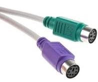
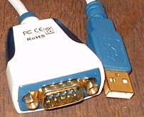
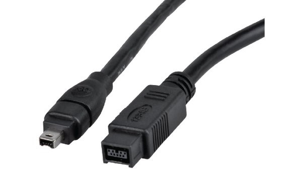
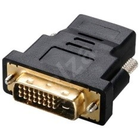
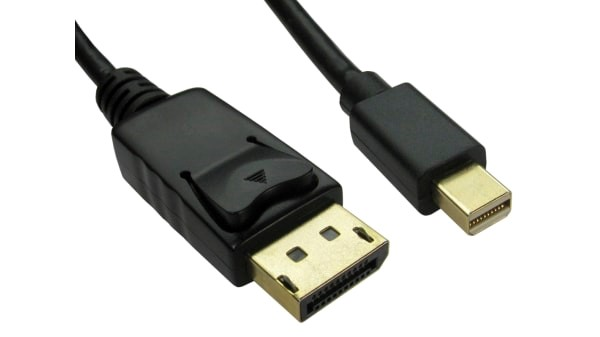

# 4. HW - periferie

- Počítačové periferie jsou zařízení zlepšující funkčnost PC
- Pod pojmem periferie si lze představit všechna zařízení připojená k PC
- Jejich úkolem je přísun dat do počítače, nebo zpracování a tisk dat, která PC zpracoval
- Dají se rozdělit do tří základních skupin:
	- Vstupní zařízení (klávesnice, myš, touchpad, skener, mikrofon, webkamera)
	- Výstupní zařízení (monitor, tiskárna, projektor, sluchátka, reproduktor)
	- Vstupně-výstupní zařízení (skener a tiskárna v jednom, dotyková obrazovka)

## Vstupní zařízení:
- Klávesnice:
    - základní vstupní zařízení počítače
    - jejím úkolem je umožnit uživateli zadávat alfanumerické a numerické nebo speciální znaky představující příkazy nebo data v textové podobě
    - signály jsou zasílány do mikrořadiče, který je přímo na klávesnici a interpretuje signály pomocí zabudovaného softwaru
    - dobu stisku klávesy také určuje mikroprocesor, rozpoznává také stisknutí několika kláves najednou
    - připojuje se nejčastěji přes USB, méně často přes starší PS/2 (fialový), Bluetooth
    - Typy klávesnic:
        - mechanická – běžný mechanický spínač, umožňuje chvilkové sepnutí kontaktů, obsahuje návratový mechanismus; vysoká šance zákmitů (špatné vyhodnocení doby stisku, počtu stisku atd.), ošetřeno firmwarem, vysoká životnost
        - membránová – životnost je dána membránou, odolná proti prachu a průniku kapaliny, zespodu membrány je uhlíkový kontakt
        - bezkontaktní – velmi vysoká životnost, nevznikají zákmity; složitější vyhodnocování signálu

- Myš:
    - vynalezena v roce 1963, použita poprvé v roce 1982 firmou Apple
    - Typy:
        - Kuličková myš:
            - po povrchu se otáčí gumová kulička, která přenáší pohyb na 2 hřídele, které mají na jednom konci ozubené kolečko, které zastiňuje diodu, která ozařuje čidlo (každé obsahuje dva snímače)
            - blikáním dokáže myš indikovat pohyb
        - Optická myš:
            - LED (laserová) dioda funguje jako zdroj světla, které je po odrazu od plochy, po které se myš pohybuje snímáno fotodiodami nebo dokonalejším optickým snímačem
            - v myši je umístěna jakási „malá kamera“
            - rychlost, kterou snímá je velmi vysoká (1000 až 5000 snímků/s)
            - když se myš pohne, je možné zjistit kterým směrem se pohybuje a jak rychle se pohybuje
            - „Fotografovaný“ povrch nesmí být dokonale hladký, jinak by nebylo možné rozeznat strukturu a posun myši
            - k vyhodnocení tohoto pohybu se v myši nalézá poměrně výkonný mikroprocesor
- Skener:
    - vstupní zařízení, které umožňuje převedení fyzické 2D nebo 3D předlohy do digitální podoby pro další použití na PC
    - čtečky čárových kódů, stolní skenery, bubnové skenery (velká plocha = drahé)
    - dělí se na dvě kategorie v závislosti na použité technologii – použití LED osvětlení, nebo použití neviditelného záření
    - princip – snímací čidlo zachycuje odražené světlo od původního dokumentu a převádí obraz do PC
    - Parametry skenerů:
        - Barevná hloubka – udává množství odstínů barev, které je schopen skener nasnímat (dnes nejčastěji 48 bitů)
        - Rozlišení obrazu – udává se obvykle v DPI (počet tiskových bodů na palec) a určuje jemnost snímání a tím i velikost výsledného obrazu
        - Velikost skenovatelné plochy

## Výstupní zařízení:
- Monitor:
    - slouží k viditelnému zobrazení textu a grafiky
    - obraz v počítači vytváří grafická karta, monitor jej pouze zobrazuje
    - skládá se z pixelů, který je tvořen ze tří subpixelů (červená, modrá, zelená - RGB)
    - množstvím pixelů se udává rozlišení obrazovky
    - Specifikace monitoru:
        - rozlišení obrazovky – max. počet pixelů, které je schopen monitor zobrazit
        - úhlopříčka – zobrazovací plocha displeje – v palcích, diagonála monitoru
        - kontrastní poměr – rozdíl mezi nejsvětlejším a nejtmavším bodem na obrazovce
        - pozorovací úhly – v určitém rozmezí úhlu by měla být obrazovka stále čitelná 
        - obnovovací frekvence – kolikrát se zobrazí celá obrazovka za jednu sekundu při daném rozlišení monitoru
    - Typy monitorů:
        - CRT (Cathode Ray Tube):
            - nejstarší druh monitoru
            - na vnitřní straně obrazovky je luminofor, který se rozsvítí po dopadu elektronového svazku vytvořeného elektronovým dělem; svazek elektronů musí dopadat na jednotlivé luminofory přesně, pokud by nesvítilo přesně, obraz by byl rozostřen
            - Nevýhody: 
                - Vysoká hmotnost obrazovky
                - Velká hloubka obrazovky
                - Obtížná výroba větších úhlopříček
                - Nutnost obnovování – blikání obrazu
                - Nepřesnost zobrazení (nepřesné vychýlení a zaostření paprsku)
                - Analogové zpracování signálu (šum, nelinearita atd. degradují obraz)
                - Obtížně se zvyšuje rozlišení
                - Nezdravé elmag. Vyzařování
                - Zkreslený obraz v okrajích
                - Zkreslení způsobené vypouklou obrazovkou
                - Vyšší el. spotřeba (např. oproti LCD a OLED)
            - Výhody:
                - žádné mrtvé body
                - výborný pozorovací úhel
                - výborná barevná věrnost
                - vysoký kontrast a jas
        - LCD displeje:
            - fungují na principu tekutých krystalů
            - za obrazovkou složenou z tekutých krystalů se nachází světelná trubice nebo LED pásek – podsvěcují obrazovku
            - toto světlo prochází polarizačními filtry a krystaly
            - uspořádání molekul LC způsobuje změnu polarizace světla – regulace množství světla
            - barva pixelu se zajišťuje průhodem světla přes barevné filtry
            - v současnosti nejrozšířenější typ displejů (s LED podsvícením)
            - Výhody a nevýhody:
                - vysoké rozlišení (4K)
                - možnost výroby velkých obrazovek
                - nižší pozorovací úhly (záleží na použité technologii)
            - Technologie:
                - TN – nejhorší obrazové parametry, velmi dobrá odezva
                - xVA – dobrá barevná hloubka, nejlepší kontrast, nevyrovnaná doba odezvy
                - IPS – nejdražší, elektrody má evdené po bocích, nejlepší barevné podání, vyrovnaná doba odezvy
            - Podsvícení:
            - LED x CCFL – CCFL má vyšší spotřebu, nižší životnost a s postupem času klesá jas; LED mají vyšší životnost a jsou energeticky efektivnější, ale produkují více tepla
        - OLED displeje:
            - dioda je vyrobena z organického materiálu – je možno vyrobit je extrémně malé
            - dioda obsahuje organický materiál, který emituje záření, pokud je na něj přiveden stejnosměrný proud
            - ohebné, vysoce svítivé, tenké a má dobré zobrazování barev
            - nevýhodou je jejich omezená životnost

- Tiskárna:
    - Parametry:
        - PPM – pages per minute
        - DPI – dots per inch
        - Konektivita – USB, WiFi, RJ-45
        - Tisk barvou, technologie
    - Typy:
        - Jehličková
            - Využívá se tisková hlava, která obsahuje řadu jehliček – ty vystřelují proti barvící hlavě
            - Základní parametr – počet jehliček (1, 2, 7-pokladny, 9-domácí použ., 24-nejrychlejší)
            - 60-100DPI
            - Výhody
                - Nízké provozní náklady
                - „nekonečný“ perforovaný papír
            - Nevýhody
                - Hlučnost
                - Rychlost
                - Nízká kvalita
        - Tepelná – podobný princip jako jehličková – jehličky jsou zahřáty na vyšší teplotu
            - lze tisknout pouze na speciální papír (časem bledne – účtenky)
            - není hlučná
        - Inkoustová
            - tisk pomocí inkoustu (je vystřikován)
            - na hlavě je několik minitrysek
            - bezkontaktní
            - vyšší rychlost tisku než u jehličkové tiskárny, vhodná pro tisk fotek i tisku
            - nízká cena
        - Laserová
            - přenos el. náboje pomocí válce
            - selenový válec je nabit laserem – vznik el. náboje, ten přitahuje tonerový prášek, který je přenesen na papír, ten je teplem a tlakem zafixován
            - tisk je rychlý, levný, s vysokým rozlišením (DPI >= 1200)
            - zatížitelnost vyšší jak u inkoustových
            - životnost dle selenového válce
            - nevýhoda – vznik ozonu
## Porty:

- PS/2 (mini-DIN)
    - používá se u klávesnice a u myši
    - DIN-6 – 6 pinů (2 nevyužity)
    - Rychlost: cca 900 B/s
    - Synchronní sériová komunikace

- COM
    - Starší typ sériového rozhraní
    - Používalo se pro připojení počítačové myši k počítači, propojení staršího mobilního telefonu s počítačem
    - V současné době se uplatňuje pouze při propojení počítače s různými měřícími systémy
    - Rozhraní už není implementováno na základní desky, nahrazeno USB
    - Nepodporuje technologii Plug and Play

- LPT
    - Starší paralelní rozhraní pro komunikaci s pomocí 17 linek
    - Původně byl vytvořen pro komunikaci s tiskárnou; jednosměrný přenos z počítače do tiskárny
    - Později byl přidán oboustranný přenost
    - Konektory – DB-25(počítač) a Centronics (tiskárna)

- USB (Universal Serial Bus)
    - 4 vodiče (bílý (data), zelený (ochrana proti rušení); červený (5V), černý (GND))
    - 4 typy přenosů:
        - Interrupt – pro myši, klávesnice (zařízení, které potřebují řízení pomocí přerušení)
            - zařízení nic nevysílají, ale host se jich ptá, jestli nejsou nové události
        - Bulk – pro přenos velkých bloků dat, např. Tiskárna, externí disky
            - aby se sběrnice nezahltila, je vše řešeno pomocí PING (data jsou rozdělena na pakety, před odesláním dalšího probšhne PING)
        - Isochronní
            - Zařízení, které vyžadují stálý přenos dat bez potvrzování (mic, reproduktor)
            - Řídící – určen pro konfiguraci USB zařízení
            - každé zařízení má popis, který sděluje hostiteli, jak budou komunikovat
    - USB 3.0 – má nově 8 vodičů
        - je částečně kompatibilní s USB 2.0
        - teoretická rychlost přenosu je až 10 Gb/s (záleží na typu)

- FireWire
    - Vysokorychlostní sériové rozhraní vyvinuté pro přenos audia a videa dat 
    - V dnešní době slouží především pro připojení digitální videokamer, externích HD a optických mechanik
    - Různá specifikace IEEE – liší se hlavně rychlostí 
    - Konektor typ 1 – obvykle se nachází v počítači a rozbočovače
    - Typ 2 – obvykle se nachází v periferním zařízení

- VGA
    - nelze přenášet zvuk
    - analogový, synchronní, jednosměrný
    - rozlišení a zobrazovací frekvence je určena připojenou periferií

- DVI, HDMI
    - DVI neumí přenášet zvuk
    - jsou digitální
    - HDMI 1.0 – jedna barevná linka 1,65Gb/s
    - HDMI 1.3 – jedna linka 3,4Gb/s
    - HDMI 1.4 – jedna linka 3,4Gb/s
    - HDMI 2.0 – jedna linka 6Gb/s
- DisplayPort
    - přenos zvuku i videa (až 4K/60Hz) 

[Otázka 3](03HW.md)

[seznam otázek](seznam_otazek.md)
            
[Otázka 5](05HW.md)
            