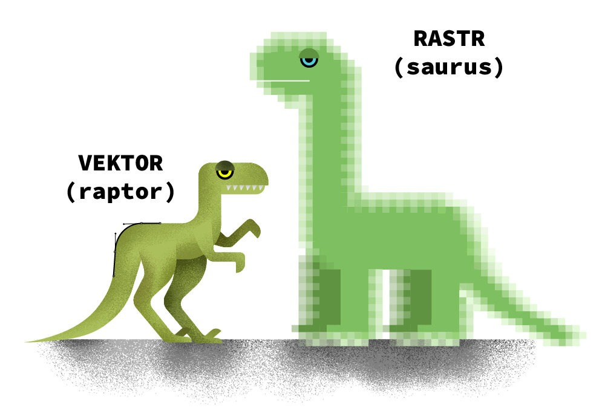

# 7. Rastrový editor 

## Rastrová grafika

- Rastrová grafika (či bitmapová grafika) je jeden ze dvou základních způsobů, jakým počítače ukládají a zpracovávají obrazové informace (druhý způsob je vektorová grafika).
- Obrázek je popsán pomocí barevných bodů (pixelů). Body jsou uspořádány do mřížek. Každý bod má určen svou přesnou polohu a barvu v nějakém barevném modelu (např. RGB). -> viz [Otázka 5](05PGF.md)
- Tento způsob popisu obrázků používá např. televize nebo digitální fotoaparát.
- Kvalitu záznamu obrazu ovlivňuje rozlišení a barevná hloubka
- K zobrazení na monitoru stačí rozlišení 72 DPI, pro tisk na tiskárně 300 DPI. 
- __DPI__ - z anglického dots per inch reprezentuje počet obrazových bodů, které se vlezou do délky jednoho palce. Někdy se užívá zkratka PPI (pixels per inch)
- Pro převod obrazových předloh (klasické fotografie, kreseb a dalších) do rastrové grafiky slouží skener nebo digitální fotoaparát
- Další možností pro ukládání a zpracování obrazů je vektorová grafika, kde se obrázek popisuje pomocí geometrických objektů - křivek a mnohoúhelníků.
- Nejmenší zobrazitelný bod na zařízení - PIT (0,1mm)

## Nevýhody rastrové grafiky 

- Změna velikosti vede ke zhoršení obrazové kvality obrázku. (ztrátová komprese)
- Poměrně velké nároky na paměťové zdroje (při vysokém rozlišení a barevné hloubce velikost obrázku dosahuje i jednotek megabytů, v profesionální grafice se běžně operuje i s podklady o desítkách megabytů)
- Zejména zvětšování obrázku je možné jen v omezené míře, neboť při větším zvětšení je na výsledném obrázku patrný rastr (viz obrázek)

## Výhody rastrové grafiky

- Přirozená volba pro digitální fotografii (a některé další typy grafiky).  
- Pořízení obrázku je velmi snadné například pomocí fotoaparátu nebo pomocí skeneru.
- Rastrová grafika/rastrové fotografie se skvěle využívá pro zachycování obrazů reality 

## Formáty rastrové grafiky 

- BMP
    - BMP (Windows Bitmap) nebo také DIB (device-independent bitmap) je počítačový formát pro ukládaní rastrové grafiky.
    - Formát BMP byl poprvé představen v roce 1988 jako součást nového systému OS/2 verze 1.10 SE. O něco později firma 
    Microsoft trochu rozšířila jeho definici a zahrnula ho do svého tehdy nejprodávanějšího 16bitového grafického operačního 
    prostředí – Microsoft Windows 3.0. Na počátku roku 1992 firma IBM uvedla na trhu první 32bitový systém OS/2 verze 2.0, 
    který obsahoval vylepšenou variantu BMP s novou strukturou pro uskladnění vícenásobných bitových map v jednom souboru. 
    Tento typ souboru se často obecně označuje jako bitmapové pole.
    - Výhodou tohoto formátu je jeho extrémní jednoduchost, dobrá dokumentovanost a fakt, že jeho volné použití není 
    znemožněno patentovou ochranou. Díky tomu jej dokáže snadno číst i zapisovat drtivá většina grafických editorů v mnoha 
    různých operačních systémech. X Window System používá podobný formát XBM pro jednobitové černobílé obrázky a XPM pro barevné obrázky.
- GIF
    - GIF (Graphics Interchange Format) je grafický formát určený pro rastrovou grafiku. 
    - GIF používá bezeztrátovou kompresi LZW, na rozdíl například od formátu JPEG, který používá ztrátovou kompresi. 
    - GIF je tedy vhodný pro reprezentaci vektorových obrázků (nápisy, plánky, loga), protože zakreslené čáry nejsou rozmazány kompresí. 
    - GIF umožňuje také jednoduché animace.
    - GIF má jedno velké omezení — maximální počet současně použitých barev barevné palety je 256 (8 bitů), 
    v případě animace pak umožňuje využít odlišné palety 256 barev pro každý snímek. Toto omezení nemá formát PNG, který se hodí ke 
    stejným účelům jako GIF a nabízí pro většinu obrazů výrazně lepší kompresi. Formát PNG však neumožňuje animace (ty umožňuje až APNG a MNG).
    - Formát GIF se stejně jako formáty PNG a JPEG používá pro WWW grafiku na Internetu.
- JPEG
    - JPEG je standardní metoda ztrátové komprese používané pro ukládání počítačových obrázků ve fotorealistické kvalitě. Formát souboru, který tuto kompresi používá, se také běžně nazývá JPEG. Nejrozšířenější příponou tohoto formátu je .jpg, .jpeg, .jfif, .jpe, event. tato jména psána velkými písmeny.
    - Skutečným názvem typu souboru je JFIF [ˌdžeiˈfif], což znamená JPEG File Interchange Format. Zkratka JPEG znamená Joint Photographic Experts Group, což je vlastně konsorcium, které tuto kompresi navrhlo.
    - Když se běžně hovoří o souboru JPEG, míní se tím většinou soubor JFIF, nebo soubor Exif JPEG. Existuje však více formátů souborů založených na kompresi JPEG, například JNG.
    - JPEG/JFIF je nejčastější formát používaný pro přenášení a ukládání fotografií na World Wide Webu. Není však vhodný pro perokresbu, zobrazení textu nebo ikonky, protože kompresní metoda JPEG vytváří v takovém obrazu viditelné a rušivé 
    artefakty. Pro takové účely se většinou používají soubory PNG a GIF. Protože má GIF pouze 8 bitů na pixel, není vhodný pro barevné fotografie, PNG je možné použít pro ukládání fotografií, ale výsledná velikost souboru je nevhodná pro publikování na webu.
- PNG
    - PNG je grafický formát určený pro bezeztrátovou kompresi rastrové grafiky. Byl vyvinut jako zdokonalení a náhrada formátu GIF. 
    - PNG nabízí podporu 24 bitové barevné hloubky, nemá tedy jako GIF omezení na maximální počet 256 barev současně. PNG tedy do jisté míry nahrazuje GIF, 
    nabízí více barev a lepší kompresi (algoritmus Deflate + filtry). Navíc obsahuje osmibitovou průhlednost (tzv. alfa kanál), to znamená, že obrázek může být v různých částech různě průhledný (tzv. RGBA barevný model). 
    - Nevýhodou PNG oproti GIF je praktická nedostupnost jednoduché animace, pro kterou sice existují 2 návrhy APNG a MNG, které se ale zatím neprosadily.

## Rastrové editory 

- Adobe Photoshop 
    - Nejpopulárnější rastrový editor 
    - Bitmapový grafický editor pro tvorbu a úpravy bitmapové grafiky (např. fotografií)
    - První verze (1.0) vyšla v únoru roku 1990 pro Mac OS pod záštitou firmy Adobe Systems. Původně je Photoshop dílem bratrů Thomase a Johna Knolla, kteří na vývoji začali pracovat již v roce 1987. Jedním z nejvýznamnějších 
    bodů byl vznik verze pro operační systém Microsoft Windows v roce 1996 (verze 4.0). Označení Creative Suite používané u nových verzí 
    vyjadřuje fakt, že je Photoshop integrován se skupinou dalších grafických programů firmy Adobe (Adobe's Creative Suite), kam patří mimo 
    jiné Adobe Illustrator či Adobe InDesign. Označení Creative Cloud, použité u verzí 14 až 20, vyjadřovalo, že je Photoshop daleko více integrován cloudově.
    - V anglickém jazyce se stále běžněji vyskytuje slovo photoshop a photoshopping ve významu digitálně upravovat (zejména retušovat) obrázky a fotografie v digitální formě (ať už v Adobe Photoshop nebo jiném programu). Přispívá k tomu fakt, že Adobe Photoshop je pro úpravu obrázků a fotografií jeden z nejznámějších programů a de facto profesionální standard. Nicméně, firma Adobe vystupuje proti takovéto konotaci.
    - Síla photoshopu je v tom, že si uživatel může projekt rozdělit do množství nezávyslích vrstev
- GIMP 
    - Program patří mezi hlavní konkurenty Photoshopu. 
    - Je open-source: 
        - Otevřený software (anglicky open-source software nebo open software, zkratka OSS) je počítačový software s otevřeným zdrojovým kódem. Otevřenost zde znamená jak technickou dostupnost kódu, tak legální (ne)dostupnost – licenci software. Licence je velmi důležitá, jelikož specifikuje, jaká práva k otevřenému kódu získá a jak s nim může nakládat jeho uživatel. Některé licence (ku příkladu GNU) například dovolují uživatelům zdrojový kód upravovat a distribuovat (na rozdíl od proprietárního software).
    - Zastupuje photoshop převážne na operačních systémech založených na linuxu