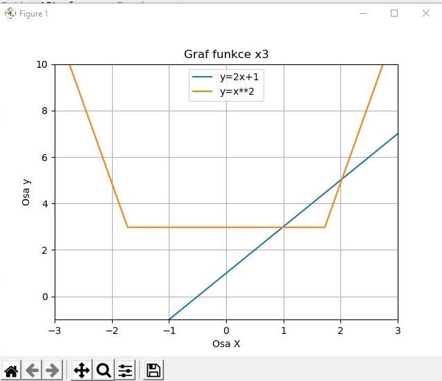
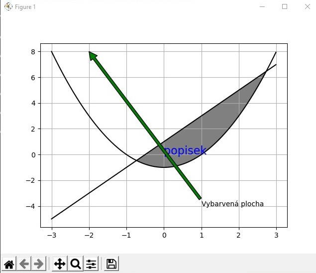

15. PRG – Vykreslování grafů

- pro vykreslování grafů se v pythonu používá knihovna PyLab, ta není součástí základní instalace pythonu, je tedy třeba si ji pomocí příkazu pip doinstalovat (pip install matplotlib a potom v programu from pylab import *)
- tato knihovna obsahuje spoustu prvků a různých druhů grafů (výsečové, sloupcové, spojnicové), můžeme doplňovat spoustu prvků a tato knihovna je celkově velmi obsáhlá

## Vektor:

- vektor se vytvoří pomocí příkazu arrange(od, do, velikost kroku):
    - podobné funkci range(), vznikne tabulka x hodnot podle nastaveného rozsahu, tento vektor se používá pro výpočet funkčních hodnot
- nebo pomocí linspace(od, do, počet kroků):
    - sin, cos, logaritmus, vše je definováno vektorově u obou možností vektorů, nemusíme (ani bychom neměli) importovat knihovnu math, pře všechny operace jsou obsaženy již v této knihovně

```python 
from pylab import * 

# x = arrange(-5,5,0.2) -> vekror x od -5 do 5 s krokem 0.2 

x = linspace(-50,50, 30) # -> vektor x od -50 do 50 s 30 hodnotami 

y1 = 2 * x + 1 
y2 = x ** 2 

grid() # zobrazení mřížky 
title('Graf funkce x3')
xlabel('Osa X') # popis osy x 
ylabel('Osa y') # popis osy y 

plot(x, y1, label='y=2x+1') # vložení údajů do grafu, určení hodnoty v legendě 
plot(x, y2, label='y=x**2') # vložení údajů do grafu, určení hodnoty v legendě 

ylim(-1, 10) #limity pro osu y
xlim(-3, 3) #limity pro osu x
legend(loc='upper center')

show() # zobarzení grafu a anulování všech nastavení
```



## Vykreslení grafu, parametry čáry:

- plot(x hodnota, y hodnota, nepovinné parametry) – vykreslí čáru v grafu
- Nepovinné parametry (některé):
    - color – barva čáry (zvlášť mimo styly)
    - linewidth – tloušťka čáry
    - label – sem se píše řetězec, který se vloží do legendy
- Styly čar:
    - Tvary:
        - o – kolečka (oval)
        - s – čtverečky (square)
        - ^ - trojúhelníčky
        - – (pomlčka) – plná čára
        - – - (dvě pomlčky) – čárkovaná čára
        - : (dvojtečka) – tečkovaná čára
    - Barvy:
        - r – červená (red)
        - b – modrá (blue)
        - atd, prostě všechny barvy, stačí říct ty základní
    - Formát:
        - vkládá se do příkazu plot() do nepovinných parametrů ve formátu BarvaStyl, např. ro = červená kolečka; g-- = zelená čárkovaná čára; bs = modré čtverce

## Legenda grafu:

- berou se data z label, plní se v průběhu příkazu plot
- legend() – slouží k zobrazení legendy
    - může se zadat parametr loc – ten určuje kde se má legenda umístit
        - když se nezadá tak se legenda automaticky umístí na nejvhodnější místo (dá se i zadat jako loc=“best“)

## Parametry grafu:

- title() – název grafu
- xlabel() – popis osy x
- ylabel() – popis osy y
- grid() – zobrazení mřížky
- xlim(od, do) – limity pro osu x
- ylim(od, do) – limity pro osu y

## Více grafů v jednom okně:

- subplot(řádek, sloupec, pořadí) – příkaz, kterým se vytvoří podgraf, podgrafy můžeme umístit do tabulky, spočítám si podle pořadí do kterého grafu chci zadávat údaje a pak je zadám
    - jakmile provedu příkaz plot(), tak se provede pouze v té oblasti, kterou jsme definovali


## Plocha pod grafem a mezi grafy:

- fill(x, y, barva) – mezi spojnicí, určenou x a y, a jinou čarou se plocha vybarví určenou barvou
- fill_between(x, y1, y2, barva) – plocha se vyplní mezi lomenými čárami (obě mají stejné x [jsou nad sebou, vyplňuje se plocha mezi nimi]), lze doplnit podmínku where, barva je facecolor, tímto příkazem barvíme pouze plochu, ne čáry

## Vložení textu do grafu:

- text(x, y, řetězec) – umístí řetězec na zvolené souřadnice v grafu
    - automaticky se vkládá nad y a vpravo nad x, ale způsob zarovnání můžeme změnit pomocí nepovinných parametrů
- annotate(řetězec,xy=(x,y),xytext=(x,y),arrowprops=dict(facecolor=color,shrink=x)) – poznámka se šipkou

```python 
x = arange(-3,3,0.01)
y1 = x**2-1
y2 = 2*x+1 
fill_between(x,y1,y2, where=(y2>y1), facecolor="gray")
plot(x,y1, "black")
plot(x,y2, "black")
text(0,0, 'popisek', fontsize='16', color="blue")

annotate('Vybarvená plocha', xy=(-2,8), xytext=(1,-4), arrowprops=dict(facecolor="g"))

grid(True)
show()

```



- šipka ukazuje od poznámky na bod xy
- poznámka je umístěna na souřadnicích xytext
- vlastnosti šipky se definují v arrowprops, shrink znamená zkrácení šipky v obou směrech, uvádí se jako des. číslo

[Otázka 14](14PRG.md)

[seznam otázek](seznam_otazek.md)
                        
[Otázka 16](16PRG.md)