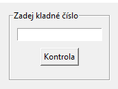

# 17. PRG – Tkinter, základní komponenty

- Tkinter je základní pythonovská knihovna pro tvorbu grafických aplikací
- Jejími přednostmi je snadné ovládání a to, že přichází nainstalovaná již se základní instalací pythonu
- Nevýhodou je v dnešní době již poměrně graficky zastaralý vzhled aplikací

## Základní syntaxe:

- knihovnu je třeba naimportovat pomocí příkazu from tkinter import * (nebo alternativní import syntaxí)
- Tk() – funkce, která založí hlavní okno programu, např. root = Tk(), do tohoto okna se umisťují veškeré prvky, oknu se dá nastavovat title, resizable() (jestli se dá zvětšovat/zmenšovat), základní velikost size(), barevné pozadí
- mainloop() – nekonečná smyčka, která zobrazí okno a čeká na události od uživatele, píše se úplně nakonec .py souboru, např. root.mainloop()
- after() – metoda hlavního okna, která se používá k pozdržení programu, čas se do ní zadává v milisekundách a vkládá se tam funkce, která se má po uplynutí času provést root.after(5000, root.destroy) (po 5 sekundách se okno zavře)
    - dá se využít třeba u časovače, stopek, zpožděné zobrazení pro uživatele...
    - dvě zdržení času spuštěné těsně po sobě jsou asynchronní, takže dvě after probíhají současně

## Umisťování komponentů:

- každou komponentu je potřeba umístit do hlavního okna pomocí jedné ze tří metod
- padx, pady – odsazení po osách
- fill – udává v jakém směru se komponenta bude rozšiřovat (vertikálně, horizontálně, oba)
- expand – jestli má komponenta reagovat na změny okna
- pack() – nejjednodušší metoda, ale taky nejhloupější; ukládá komponenty pod sebe zabalené do obdélníkových oblastí v tom pořadí, jak jsou napsány v kódu
    - samozřejmě lze také s touto metodou pozicovat pomocí side, ta může mí parametry třeba right, left ale není to ono
- place() - umožňuje umístění komponenty na konkrétní souřadnice
    - absolutní určení souřadnic – počítá se z levého horního rohu, v pixelech, např. napis.place(x = 0, y = 10), tento text se nehýbe se zvětšováním okna
    - relativní určení souřadnic – zadává se v des. číslech, nejmenší hodnota je 0, největší 1, např. napis.place(relx = 0.1, rely = 0.5), vždy se nachází třeba v půlce okna, takže se hýbou
    - může se přidat i kotevní bod komponenty „anchor“
    - nevýhodou je že se komponenty mohou překrývat, nebo že zadáme špatné souřadnice a komponenta bude mimo okno
- grid() – asi nejvyužívanější metoda, ukládá komponenty do „mřížky“, která se skládá z řádků (row) a sloupců (column), pozice widgetu je dána hodnotami, které k nim napíšeme
    - jednotlivé buňky lze spojovat pomocí columnspan nebo rowspan, sem se píše přes kolik sloupců/řádků má být roztažen
    - grid umí sám určit optimální velikost komponenty
    - např. napis.grid(row = 0, column = 1)
    - parametrem sticky zarovnáváme, používají se zkratky světových stran (S, NW, SW...), objekt se také dá roztáhnout kombinací např. W+E (west+east)...

## Komponenty:
- Label() – základní komponenta pro zobrazování textu v okně či dialogu
    - např. napis = Label(root, text = “Text v labelu“)
    - základem je do labelu přiřadit text, to je text který se vypíše, následně má label spoustu dalších možností co přidat, většina se týká úprav vzhledu textu, např. fg (barva textu), bg (barva pozadí textu), font (úprava fontu, velikost, styl)…
- Button() – tlačítko, např. button = Button(root, text = “Klikni“, command = funkce_tlacitka)
    - po stisknutí provede nějakou výše definovanou funkci, tu musíme uvádět bez závorek (pouze adresa fce => nesmí mít parametry), jinak by se spustila ihned po spuštění programu
    - má spoustu dalších možností, jako width, height
- Entry() – základní komponenta pro vstupy od uživatele, například řetězců, čísel…
    - umožňuje zadat jeden řádek textu, jeli potřeba více řádků, je potřeba použít widget Text()
    - do entry lze vkládat v programu pomocí metody insert(hodnota), smazat celé entry lze pomocí metody delete()
    - např. e = Entry(root)
    - hodnoty z entry se dostávají pomocí metody get()
    - hodnoty z Entry lze také zjistit pomocí textvariable e = Entry(root, textvariable = x), x se musí výše definovat jako x = StringVar(), vrací řetězec
- Frame() – slouží jako geometrický manažer, používá se pro seskupení určitých elementů
    - fr = Frame(root), ten se podé nejčastěji gridem vloží na určitou pozici
    - poté se do fr přidávají jednotlivé komponenty; prostor uvnitř něj lze také rozdělit třeba pomocí gridů, z toho vyplývá, že můžeme jednu pozici v hlavním okně pomocí Frame rozdělit na více pozic a tím na ni dát více komponent
    - 
    - důležité je, aby všechny komponenty které mají být ve fr měly místo root napsáno právě fr, např. label = Label(fr, text = “Text labelu“)
    - frame lze nastavovat barvu pozadí, okraje, odsazení…
- LabelFrame() – dost podobné jako Frame(), jen má kolem sebe v rámečku nápis
    - labelfr = LabelFrame(root, text = “Text v rámečku“)

## Proměnné v Tkinteru:

- používají se u většiny vstupních komponent, je to asi nejlepší možnost jak sledovat zadávané hodnoty
- zavedly se z důvodu, že je jejich stav možné sledovat a změna proměnné se projeví jako událost a je na ni tím pádem možné okamžitě reagovat
- připojují se ke komponentům pomocí textvariable nebo variable
- CheckButton a RadioButton dokonce použití těchto proměnných vyžadují
- IntVar() – proměnná, která bere celá čísla (int)
- BooleanVar() – hodnoty bool, tzn. True/False, 1 = True, 0 = False
- StringVar() – bere řetězec
- DoubleVar() – desetinná čísla
- mají metody jako get() (pro získání hodnoty), set() (pro nastavení hodnoty)
- při nastavování nastavíme hodnotu do proměnné a automaticky ji převezme i komponenta, ke které je proměnné přiřazena, tzn. komponenta a proměnná jsou obousměrně propojeny

## Základní úpravy komponent:

- základní konfigurace lze provádět pomocí configure(parametr=hodnota,…) např. label.configure(bg=“red“)
- background – barva pozadí widgetu
- foreground – barva popředí widgetu, např. text
- borderwith – šířka okraje widgetu
- relief – způsob prostorového zobrazení widgetu (pro tvorbu rámečku u Frame)
- font – jméno fontu pro text
- text – text, který má být ve widgetu zobrazen
- justify – zarovnání textu ve widgetu v případě, že je na víc řádků
- anchor – způsob umístění textu či obrázku ve widgetu
- width, height – výška, šířka komponenty

[Otázka 16](16HW.md)

[seznam otázek](seznam_otazek.md)
                        
[Otázka 18](18HW.md)