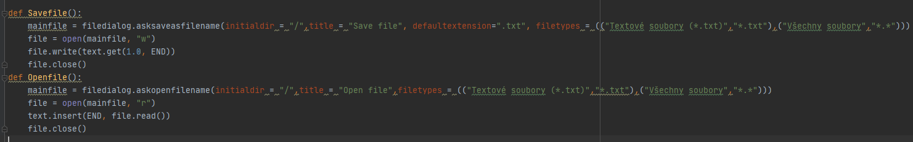
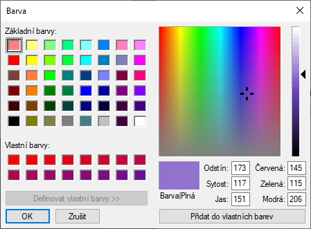
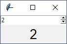
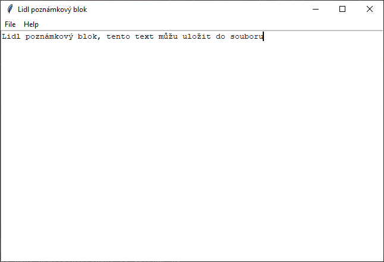
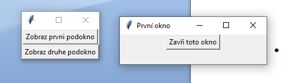

# 18. PRG – Tkinter, speciální komponenty

- Tkinter je základní pythonovská knihovna pro tvorbu grafických aplikací
- Jejími přednostmi je snadné ovládání a to, že přichází nainstalovaná již se základní instalací pythonu
- Nevýhodou je v dnešní době již poměrně graficky zastaralý vzhled aplikací

## Základní syntaxe:

- knihovnu je třeba naimportovat pomocí příkazu from tkinter import * (nebo alternativní import syntaxí)
- Tk() – funkce, která založí hlavní okno programu, např. root = Tk(), do tohoto okna se umisťují veškeré prvky
- mainloop() – nekonečná smyčka, která zobrazí okno a čeká na události od uživatele, píše se úplně nakonec .py souboru, např. root.mainloop()

## Události:

- používají se pro jiný druh vstupu od uživatele, např prostě u hry zmáčkni Enter abys pokračoval
- nebo třeba se dají použít třeba zmenšení okna = událost...
- bind() – důležitá komponenta u událostí
        
    - většinou se používá pro rozpoznání nějakého vstupu většinou z myši, např. levé, pravé tlačítko
    - jeho obsahem je, na které tlačítko má reagovat a samotná funkce, která se tím spustí
    - tlačítko se píše do <>, popřípadě se do toho píše i klávesa z klávesnice, na kterou má program reagovat, např. .bind(“<F1>“, funkceF1), nebo i pouze <Key>, což znamená jakoukoli klávesu
    - ```<Button-1>``` - Tlačítko na myši je stisknuto nad komponentou, Button 1 je úplně vlevo, Button 2 je uprostřed a Button 3 je vpravo na myši. Když stlačíte tlačítko myši na komponentě, Tkinter automaticky zachytí ukazatel myši a událost myši je zaslána funkci, aktuální pozice ukazatele myši (vzhledem ke komponentě) je pak přístupna v atributech x a y události, zaslané funkci
    - ```<B1-Motion>``` - Myš se pohybuje se stisknutým tlačítkem 1, aktuální pozice myši je poskytována v atributech x a y v události zaslané funkci.
    - ```<ButtonRelease-1>``` - Tlačítko 1 bylo uvolněno. Aktuální pozice myši je poskytována v atributech x a y v události zaslané funkci.
    - ```<Double-Button-1>``` - Na Tlačítko 1 bylo dvojkliknuto. Jako prefixy můžete použít Double nebo Triple
    - ```<Enter>``` - Ukazatel myši vstoupil na widget (tato událost neznamená, že uživatel stiskl Enter !).
    - ```<Leave>``` - Ukazatel myši opustil widget

     ```python 
        my_canvas.bind("<Button-1>", click)
        my_canvas.bind("<B1-Motion>", obdelnik)
    ```

    
## Dialogy:

- Messagebox – umožní zobrazení chybové hlášky, informační hlášky nebo varování
    - musí se samostatně importovat pomocí from tkinter import messagebox
    - všechny tři mají společný formát (liší se pouze graficky), jako první se musí uvést název okna, poté samotný text
    - showinfo(název_okna, text v okně) – umožňuje vypsání nějaké informace v pop-up okně
    - showwarning(název_okna, text v okně) – umožňuje vypsání nějakého varování v pop-up okně
    - showerror(název_okna, text v okně) – umožňuje vypsání nějaké chybové hlášky v pop-up okně
- Souborové dialogy – tato komponenta umožňuje otevírání a vyhledávání souborů, tak jak to funguje všude normálně, výsledkem tohoto dialogu je cesta k souboru ve formě řetězce, to se dosadí do standardního otvírání/zavírání souborů v pythonu
    - musí se, podobně jako messagebox samostatně importovat jako from tkinter import filedialog
    - dvě základní funkciality jsou asksaveasfilename() (uložení souboru) a askopenasfilename() (otevření souboru)
    - asksaveasfilename() – stará se o ukládání, lze v něm nastavit základní příponu ukládaného souboru, titulek a nebo třeba výchozí directory
    - askopenasfilename() – stará se o otevření souboru, znovu se v něm dá nastavit výchozí přípony, které soubory chceme otevírat
    - 


- Barevný dialog – předprogramovaná komponenta v tkinteru, umožňuje nám vybírání barev, musí se samostatně importovat from tkinter import colorchooser, při volání se ideálně ukládá rovnou do proměnné, např. barva = colorchoose.askcolor(title = “Barva“), title je název okna 
    - vrací nám n-tici, která obsahuje decimální (to je také n-tice, tedy výstupem je n-tice v n-tici) a hexadecimální hodnotu dané barvy, k těm se poté přistupuje normálně přes indexy, např. ((145.56640625, 115.44921875, 206.8046875), '#9173ce')
    - 


## Komponenty:


- Spinbox() – přepínací seznam, nejčastěji se používá, když je potřeba vybrat číslo z nějakého určitého intervalu
    - dá se omezit od kolika do kolika je maximální možný výběr, nebo se dají přesně specifikovat hodnoty, které se budou zobrazovat pomocí n-tice
    - increment – velikost kroku
    - from_ - odkud se začíná
    - to – kde se končí



- Text() – komponenta, která vytvoří textové pole, do kterého lze zadávat text i do více řádků (narozdíl od Entry) a získat jej zpátky, podporuje také vkládání obrázků a oken
    - text se vkládá přímo při běhu aplikace, nebo pomocí metody insert()
    - text se dá upravovat pomocí tag_config(), v této metodě se dá upravit font, barva, podtržení…
    - díky této komponentě se dá poměrně jednoduše vytvořit normální poznámkový blok
- Canvas() – plátno, které poskytuje strukturovanou grafiku pro Tkinter, vektorová grafika
    - dá se využít pro kreslení grafů a rysů a na implementaci nejrůznějších uživatelských udělátek, když se tam nějaký objekt tak se uloží do seznemu čísel, každé číslo odpovídá jednomu objektu, díky tomu se může upravovat již vytvořený objekt
    - pro tvorbu nějakého tvaru se používá metoda create, pro samotné přidání se za create přidá _nejakytvar, např. create_rectangle
    - line - čára
    - oval - kruh nebo elipsa
    - polygon - mnohoúhelník
    - rectangle - čtverec
    - text - text
    - každý tvar si musí určit souřadnice, rozměry a nepovinně jestli má být barevně vyplněn, jeho ohraničení…
- Menu – v aplikaci můžeme vytvořit i menu, tvoří se hlavně kvůli úspoře místa
    - tvoří se moje_menu = Menu(root)
    - do menu se přidávají položky pomocí metody add_command(nazev, command), do ní se specifikuje název položky a command, tzn. co se má po kliknutí provést (docela se to podobá tlačítkům)
    - poté se pro zobrazení menu musí provést příkaz root.config(menu = moje_menu) (nebo se to definuje už na začátku), hlavní okno může mít pouze jedno menu
    - variací této komponenty je rozbalovací menu
    - to se liší pouze tím, že se prakticky pro jednu položku v menu vytvoří další menu, do hlavního menu se přidá pomocí funkce add_cascade(label, menu)
    - v rozbalovacím menu se dají položky oddělovat třeba čárou, příkaz add_separator()
    - v rozbalovacím menu může být další rozbalovací menu, dají se na sebe teoreticky nekonečně navazovat
```python 
    mainmenu = Menu(root)
    menufile = Menu(mainmenu, taeroff=0)
    menufile.add_command(label="Open", command=Openfile)
    menufile.add_command(label="Save", command=Savefile)
    menufile.add_separator()
    menufile.add_command(label="Save", command=root.quit)
    menufile.add_cascade(label="File", menu=menufile)
```


- TopLevel() – komponenta, která umožňuje vytváření podoken
    - tvoří se podokno = TopLevel(), dále se s ním pracuje podobně jako s hlavním oknem
- můžeme do něj umisťovat tlačítka, dávat mu title, prostě normální okno
- při vyvolání podokna stále můžeme interagovat s hlavním oknem, pokud to nezakážeme



## Základní úpravy komponent:

- základní konfigurace lze provádět pomocí configure(parametr=hodnota,…) např. label.configure(bg=“red“)
- background – barva pozadí widgetu
- foreground – barva popředí widgetu, např. text
- borderwith – šířka okraje widgetu
- relief – způsob prostorového zobrazení widgetu (pro tvorbu rámečku u Frame)
- font – jméno fontu pro text
- text – text, který má být ve widgetu zobrazen
- justify – zarovnání textu ve widgetu v případě, že je na víc řádků
- anchor – způsob umístění textu či obrázku ve widgetu
- width, height – výška, šířka komponenty

## Proměnné v Tkinteru:

- používají se u většiny vstupních komponent, je to asi nejlepší možnost jak sledovat zadávané hodnoty
- zavedly se z důvodu, že je jejich stav možné sledovat a změna proměnné se projeví jako událost a je na ni tím pádem možné okamžitě reagovat
- připojují se ke komponentům pomocí textvariable nebo variable
- CheckButton a RadioButton dokonce použití těchto proměnných vyžadují
- IntVar() – proměnná, která bere celá čísla (int)
- BooleanVar() – hodnoty bool, tzn. True/False, 1 = True, 0 = False
- StringVar() – bere řetězec
- DoubleVar() – desetinná čísla
- mají metody jako get() (pro získání hodnoty), set() (pro nastavení hodnoty)
- při nastavování nastavíme hodnotu do proměnné a automaticky ji převezme i komponenta, ke které je proměnné přiřazena, tzn. komponenta a proměnná jsou obousměrně propojeny


[Otázka 17](17PRG.md)

[seznam otázek](seznam_otazek.md)
                        
[Otázka 19](19PRG.md)