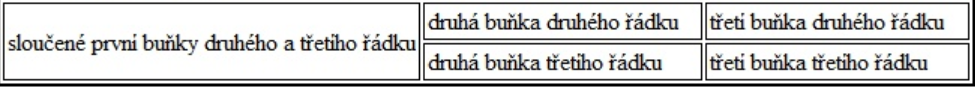

# 20. Jazyk HTML


- Hypertextový značkovací jazyk (Hypertext Markup Language) je v dnešní době nejoblíbenější jazyk pro vytváření jednoduchých stránek, skládá se ze značek, tagů, příkazů..., pomocí toho určujeme jakým způsobem se text na stránce zobrazí
- Značkovací jazyk rozumíme, že pomocí něho označkujeme části textu, hodnoty
- HTML dokument můžeme různými CSS soubory zajistit různé vzhledy, a naopak různým HTML souborům můžeme zajistit pomocí CSS stejný vzhled
- HTML – používá se pro formátování textu a objektů, které se zobrazují ve webových prohlížečích
- Statický jazyk – slouží pouze pro zobrazení
- Dynamické technologie – JavaScript – dotváří web různými animacemi a interakcemi pro zpříjemnění prohlížení webových stránek
- Každý HTML soubor má pevně danou strukturu, která musí být dodržena, musí obsahovat:
    - Začátek html souboru
    - Hlavičku (head) 
    - Tělo (body)
## Začátek HTML souboru:
- NAD HTML blok se píše příkaz, který určuje, v jaké verzi HTML je stránka napsána, např. ```<!DOCTYPE HTML PUBLIC "-//W3C//DTD HTML 4.01 Transitional//EN">```
- celý HTML soubor se vymezuje značkami ```<HTML>``` a ```</HTML>```, těmi začíná a končí celý soubor
## Hlavička (header):
- vymezuje se značkami ```<head>``` a ```</head>```
- v prohlížeči se nezobrazuje, slouží pouze pro nastavení webové stránky pro prohlížeč, uvádí se zde např. autor, editor použitý pro tvorbu, jazyková sada...
- v případě že není připojen CSS soubor, tak se zde uvádí styly
- zde se také píší skripty jazyka JavaScript
- obsahuje další podřízené značky:
    - ```<meta>``` - základní nastavení HTML stránky
    - ```<title>``` - titulek webové stránky (zobrazí se v titulkovém pruhu okna, nebo na kartě prohlížeče)
        - ```<title>```Titulek webové stránky```</title>```
    - ```<link>``` - slouží pro propojení s jiným souborem, nejčastěji CSS stylem
        - má atributy rel, tref, type
        - ```<link rel=“stylesheet“ type=“text/css“ href=“styly.css“>```
    - ```<style> </style>``` - slouží pro zapsání CSS stylu, pokud není připojen samostatný soubor   
    - ```<script> </script>``` - slouží pro zapsání skriptu jazyka JavaScript

## Tělo (body):
- vymezuje se značkami ```<body>``` a ```</body>```
- v body je uveden celý obsah stránky v příkazech

## Tagy v HTML:

- Jednotlivým značkám se říká tagy a jsou uzavřeny ve špičatých závorkách
- Tagy můžeme rozlišovat na:
    - Párové = znamená, že každý tag musí mít svůj začátek a konec – značen lomítkem za první špičatou závorkou u druhého prvku
    - Nepárové = znamená, že tag obsahuje pouze počáteční tag a konečný se nezapisuje
- Nebo na blokové a řádkové prvky
- u párových (i nepárových) tagů je v prvním z dvojice možnost upravovat podobu obsahu tagu, např. nastavovat šířku, výšku, barvu, propojovat s CSS souborem pomocí tříd a identifikátorů
    - samotným těmto vlastnostem se říká atributy, syntaxe: width=“200px“, může jich být více a oddělují se mezerou

### Blokové prvky:
- ```<p>``` - odstavec, základní blok, obsahuje převážně text
    - párová značka
    - ```<p>Tento odstavec má jednu větu.</p>```
- ```<h1>```-```<h6>``` - nadpisy 1. až 6. úrovně (liší se velikostí písma)
    - prakticky se využívají max. H4
    - párová značka
    - ```<h1>Velký nadpis</h1>```; ```<h3>Menší nadpis</h3>```
- ```<div>``` - oddíl, zahrnuje libovolnou část HTML obsahu
    - párová značka, využívá se pro rozdělení HTML dokumentu do několika částí, se kterými pak lze pracovat odděleně
- ```<div>``` <br>
```<p>Tento text je v oddílu</p>``` <br>
```</div>``` 

- ```<br>``` - nepárový příkaz, slouží k zalomení řádku
    - ```<p>Tento text je na prvním řádku <br> tento na druhém</p>```

- `````` - pro vložení obrázku
    - SRC – musí být uveden vždy, značí cestu k obrázku (relativní nebo absolutní cesta)
    - jpg, gif, png
    - ``````
    - ALT – povinný atribut, alternativní popisek obrázku
    - definuje se pro případ špatného načtení/vymazání obrázku, aby se zobrazilo aspoň něco
    - ``````
    - TITLE – nepovinný atribut, definuje titulek obrázku (zobrazí se po najetí myší na obrázek)
    - ``````
    - WIDTH, HEIGHT – šířka a výška obrázku, často se definuje již v CSS
    - ``````
### Seznamy
- Odrážkový seznam – začíná ```<ul>```
    - ```<ul>``` <br>
    ```<li>položka</li>``` <br>
    ```<li>položka</li>``` <br>
    ```</ul>```
- Číslovaný seznam – začíná ```<ol>```; pomocí atributu start=“x“ lze nastavit vlastní začátek seznamu
    - ```<ol>``` <br>
    ```<li>položka</li>``` <br>
    ```<li>položka</li>``` <br>
    ```</ol>``` <br>

### Řádkové prvky:
- ```<strong>``` - silné zvýraznění, párová značka
    - ```<p>Normální text <strong>silně zvýrazněný text</strong></p>```
- ```<em>``` - kurzíva, novější, párový příkaz
    - ```<p>Normální text <em>text kurzívou</em></p>```
- ```<b>``` - tučné písmo, párová značka, zastaralé -> lepší je použít strong
    - ```<p>Normální text <b>tučný text</b></p>```
- ```<i>``` - kurzíva, zastaralé (em lepší), párová značka
    - ```<p>Normální text <i>kurzíva</i></p>```
- ```<sub>``` a ```<sup>``` - dolní a horní index
- ```<span>``` - obálka; stejné využití jako <div>, jen na řádku
    - ```<p>Normální text <span>tento text lze formátovat odděleně</span></p>```

### Odkazy:
- odkazy na jiné weby, soubory, videa… (ve formě obrázku, textu…)
- ```<a>``` - párová značka, řádkový element
- HREF – nejdůležitější a povinný atribut definující cíl odkazu
    - ```<a href=https://www.seznam.cz>Odkaz na seznam</a>```
- TARGET – atribut určující, kde se má odkaz otevřít
    - má několik hodnot:
        - _blank – otevře se v novém okně/záložce
        - _parent – otevře odkaz v nadřazeném Html prvku
    - ```<a href=https://www.seznam.cz target=“_blank“>Odkaz na seznam</a>```
- můžeme odkazovat na tři možnosti:
    - lokální soubor (pdf, další HTML na stejné stránce...), soubor je uložen na stejném PC/serveru na kterém se nachází stránka
        - můžeme uvést relativní nebo absolutní cestu
    - internetový odkaz – musí začínat použitým protokolem (HTTP, HTTPS)
    - rolovací odkaz – můžeme odkazovat na část stránky, na které je odkaz použit
    - odkazujeme se jen na nějaké značky na té stránce, používá se např. pro návrat odspodu stránky zpět nahoru

###Definice barev:
- pomocí anglického názvu barvy, např. red, green...
    - moc se nevyužívá, protože nemáme moc široký výběr (občas když seš línej tak jo M.)
- pomocí hexadecimálního zápisu, např. #1f254a
    - nejpoužívanější, nepřehlednější
- pomocí decimálního nápisu, např. rgb(220, 20, 15)
    - také se používá, ale ne tak moc jako hexa

### Tabulky:
- tabulka se skládá z několika částí: hlavička, tělo, řádek, buňka
- Hlavička tabulky:
    - ```<thead>``` - jsou zde uvedeny popisy sloupců tabulky
- Tělo tabulky:
    - ```<tbody>``` - obsahuje hlavní obsah tabulky
- Řádek tabulky:
    - ```<tr>``` - každá tabulka obsahuje alespoň jeden řádek, párový příkaz
- Buňka tabulky:
    - nejmenší nedělitelná součást tabulky
        - ```<th>``` - buňka záhlaví tabulky (moc se nepoužívá)
        - ```<td>``` - buňka těla tabulky
- Slučování buněk:
    - COLSPAN – vodorovné sloučení buněk
    - ROWSPAN – svislé sloučení buněk
- Příklad:

```html
<table>

<thead>

<tr>

<th colspan=“3“>sloučené tři buňky prvního řádku</th>

</tr>

</thead>

<tbody>

<tr>

<td rowspan="2">sloučené první buňky druhého a třetího řádku</td> <td>druhá buňka druhého řádku</td>

<td>třetí buňka druhého řádku</td>

</tr>

<tr>

<td>druhá buňka třetího řádku</td>

<td>třetí buňka třetího řádku</td>

</tr>

</tbody>

</table>
```





[Otázka 19](19HW.md)

[seznam otázek](seznam_otazek.md)
                        
[Otázka 21](21HW.md)