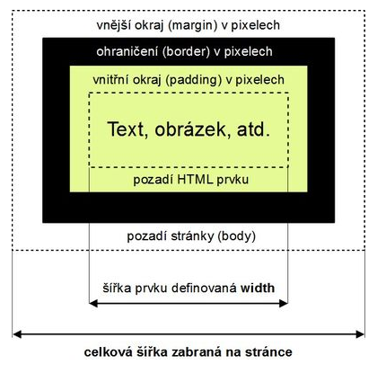

# CSS – Kaskádové styly

- Slouží pro úpravu vzhledu souboru HTML a změně vizualizace stránek a jejich úpravy
- Můžeme definovat pro každý tag zvlášť
- Je důležité propojit css soubor se souborem HTML pomocí tagu 'LINK' jinak by CSS styly nefungovaly
- Není třeba u každého HTML souboru samostatně definovat styly, ale stačí je uvést jen v jednom souboru (oddělí se formátovací informace od obsahových)
- CSS má obecně mnohem lepší možnosti formátování a grafických úprav než HTML

## Syntaxe:

- CSS styly se píší do složených závorek a před každou závorkou definujeme na jakou oblast HTML dokumentu se budou kaskádové styl vztahovat
- zápis CSS se skládá ze tří částí – selektor, vlastnost, hodnota
    - typy selektorů – určuje, kterého prvku se úprava týká; dělí se na:
        - selektor značkový (body, h2, p)
        - selektor vnořený (píše se jako table td {týká se buněk v tabulce})
        - selektor složený (týká se více prvků (h1, h2, h3 dohromady)
        - selektor třídy a identifikátorů – třída se používá s tečkou, id s mřížkou, používá se pokud chceme stejný styl pro více prků
            - třída – pro více prvků, můžeme použít opakovaně
            - identifikátor – jednorázové použití
            - pro použití v HTML: 
            
            ```html:5
            <p class=“trida“>Toto je formátováno třídou</p>
            <p id=“identita“>Toto je formátováno identifikátorem</p>
            ```
    - vlastnost – klíčové slovo, které je přesně specifikované a slouží pro grafickou úpravu
        - např. background-color, font-size
        - oddělují se středníkem
    - hodnota – samotná hodnota, od vlastnosti se odděluje “:“

## Možnosti zápisu (umístění) CSS:

- Přímý styl – přímo k HTML prvku
    - moc se nepoužívá, protože popírá hlavní výhodu CSS
    
    ```html:5
    <p style="color: blue;">Modrý text</p>
    ```
    
    - V hlavičce souboru – častější využití než přímý zápis, ale nepraktický při práci s více soubory
    
    ```html:5
    <style type=“text/css“> p {color: blue} </style>
    ```
    
    - Do samostatného souboru – nejpoužívanější způsob, má příponu CSS, je potřeba jej linknout do HTML souboru
    
    ```html:5
    <link rel="stylesheet" href="https://435c0b58-5756-4a01-a592-0f96891232c6.vscode-webview-test.com/vscode-resource/file///c%3A/Users/mproc/.vscode/extensions/cweijan.vscode-office-1.9.1/resource/styls.css">
    ```
    
    - priorita: 1. přímý styl, 2. v hlavičce souboru, 3. samostatný soubor


## Délkové jednotky:

- Absolutní – mají pevnou hodnotu, která bude na všech zařízeních stejná
    - používají se mm, cm, palce
    - jednoduše fyzikální jednotky jsou absolutní
    - pt – odvozeno od palců
- Relativní – hodnota se mění v závislosti např. na zařízení, na kterém si stránky prohlížíme
    - px – relativní, protože každé zařízení má pixely jinak velké (jen o desetiny)
    - procenta % - nejpoužívanější relativní jednotka, prvku se přiřadí procentuální velikost odvozená od šířky okna, nebo nadřazeného prvku
    - em, ex – odvozuje se od velikosti šířky písmene m nebo x, vztahuje se k danému fontu a velikosti písma


## Tagy '__div__' a '__span__':

- vznikly až se zavedením CSS, protože bylo potřeba mít nějaké prvky, které „nic neznamenají“ a pouze rozdělují HTML do bloků, ke kterým lze přistupovat samostatně
- pomáhají vytvářet „nadřazenou“ strukturu HTML tagů
- '__div__' - blokový tag, používá se pro „obalení“ několika blokových prvků, např. odstavců, obrázků...
- '__span__' - řádkový tag, funguje prakticky stejně jako '__div__'


## Schéma bloku (boxu):

- Obsah prvku – nastavují se mu vlastnosti jako width, height..., prostě normální CSS
- rozlišují se dva typy okrajů
    - vnější okraj (margin) – vzdálenost mezi ohraničením daného prvku a ohraničením jiného prvku
    - vnitřní okraj (padding) – vzdálenost mezi obsahem elementu a jeho ohraničením
    - samozřejmě lze nastavovat margin-top atd.
- Border (ohraničení) – nastavuje se mu styl čáry (čárkované, plné...), tloušťka a barva
- border-radius – nastavuje zaoblení ohraničení, udává se v %



## Nějaký ty základní styly, ale Stejsky se na to asi ptát nebude (spíš taková záchrana):

## Definice barev:

- pomocí anglického názvu barvy, např. red, green...
    - moc se nevyužívá, protože nemáme moc široký výběr
- pomocí hexadecimálního zápisu, např. #1f254a
    - nejpoužívanější, nepřehlednější
- pomocí decimálního nápisu, např. rgb(220, 20, 15)
    - také se používá, ale ne tak moc jako hexa

## Písmo:

- vše co se týká písma začíná prefixem font – tím se dá také zapsat vše níže zmíněné, je ale potřeba dodržet přesné pořadí, jak je uvedeno odshora dolů
- font-style – normal/italic = nastavuje kurzívu
- font-weight – nahrazuje '__strong__' nebo '__b__'; tučné písmo
- font-size – velikost písma, uvádí se v pixelech (px), textových bodech (pt), nebo v %
- font-family – typ písma (Arial, Verdana, Calibri…)

## Text:

- text-align – zarovnání všech blokových prvků – left, right, center, justify (do bloku)
- line-height – nastaví výšku řádku (řádkování), uvádí se des. číslem, procenty, nebo px/pt
- text-decoration – efekty písma (underline: podtržení, overline: nadtržení, line-through: přeškrtnutí)

## Obtékání:

- používá se float
- nastaví se vybranému HTML prvku, ten ale musí mít nastavenou width
- používají se dvě hodnoty – left a right, záleží z které strany chceme prvek „obtéct“
- pro ukončení je potřeba použít clear – ten se nastaví poslednímu prvku a tím se odtékání ukončí

## Nastavení pozadí:

- na pozadí se dá vložit obrázek; background-image: url(´img/obrazek.jpg´)
- background-size – roztažení nebo smrsknutí obrázku na pozadí
    - několik hodnot:
        - auto – výchozí hodnota, neupravený obrázek
        - 100% - obrázek se na pozadí zmenší/zvětší tak, aby se na šířku vešel jednou (výška se přizpůsobí, obrázek se nebude deformovat)
        - 100% 100% - obrázek se na pozadí zmenší/zvětší tak, aby se na šířku i výšku vešel jednou (obrázek se deformuje)
        - contain – obrázek se delší stranou přizpůsobí prvku, nedeformuje se
        - cover – obrázek se kratší stranou přizpůsobí prvku, nedeformuje se